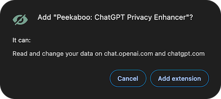

# Peekaboo: ChatGPT Privacy Enhancer 👀🔒

👋 Sup welcome to **Peekaboo**, a tiny Chrome extension that keeps your ChatGPT history private in the simplest, sleekest way possible.

## Why Is This Necessary? 🤔

I've noticed when people share their screens on YT videos, live calls, or streaming - they often rush to close their ChatGPT history pane. It's not a huge deal, but let's be real: some people just don't want to broadcast their curious thoughts to the world. Or maybe they're building something in stealth.

So Peekaboo was born within the hour - it's a super simple, minimal solution to make that easier. No more scrambling to close tabs before you share your screen or need to stave off inquisitive eyes in public. Tell them to gtfo.

## What Does Peekaboo Do?

Peekaboo automatically **blurs your ChatGPT history items**, keeping your chat topics tastefully hidden.

Hover over any blurred conversation to reveal it when you need it.

## How to Get Started 🚀

1. **Install the Extension**: Add Peekaboo from the Chrome Web Store: [link here](https://chromewebstore.google.com/detail/peekaboo-chatgpt-privacy/mloaapjbhaopofjpcihoacjanjdejmcg).
2. **Privacy by Default**: Your ChatGPT history will blur automatically. No setup required.
3. **Hover to Reveal**: Want to see your history? Just hover your mouse over each row and it'll automatically unblur.
4. **Toggle Blur**: To turn the blur off just use the toggle in the extension popup.

## Why Use Peekaboo? ✨

- **Stay Private**: No one needs to see your ChatGPT history unless you want them to.
- **Quick Peek**: Hover over blurred items to reveal them on-demand.
- **Toggle Control**: Turn the blur on or off instantly via the extension popup.
- **Clean and Simple**: Just privacy that blends into ChatGPT's look and feel, nothing extra.
- **Free Forever**: Bc why not.

## Privacy 🔒

This extension **doesn't collect, store, or share any of your data**.

Yes, there’s a scary popup that says the extension can read and change your data. This just means it can access the page content to blur the html elements (check the code!).

All processing happens locally on your device, and no data is collected, stored, or shared.

## FAQ 🙋

### Q: Can I turn off the blur effect?

A: Furrrsure. Just click the extension icon in your browser, and toggle the blur on or off.

### Q: Does Peekaboo collect my data?

A: Nahhh. No data is collected, transmitted, or stored. Trust me I don't wanna see what you're talking about with ChatGPT 👀

### Q: Does this work on other LLM chats?

A: Just ChatGPT for now, but feel free to DM me with any requests.

## Feedback or Questions? 💬

Hit me up on Twitter: https://x.com/brianautomates

🫰
