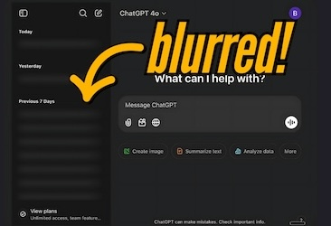
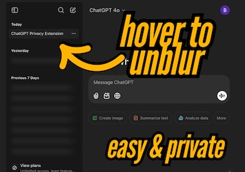
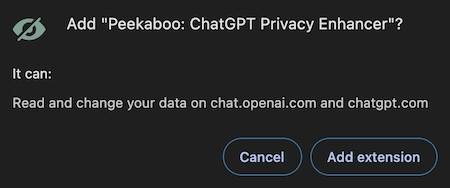

# Peekaboo: ChatGPT Privacy Enhancer
Sup! Welcome to **Peekaboo**, a tiny Chrome extension that keeps your ChatGPT history private in the simplest, sleekest way possible.

[Find it on the Chrome Web Store](https://chromewebstore.google.com/detail/peekaboo-chatgpt-privacy/mloaapjbhaopofjpcihoacjanjdejmcg)

## What Does Peekaboo Do?

Peekaboo automatically **blurs your ChatGPT history items**, keeping your chat topics tastefully hidden.

Hover over any blurred conversation to reveal it when you need it.

## Why's This Necessary? 🤔

**TLDR**: _Do you feel EXPOSED when ppl peep your chat history? Then this is for you._

I've noticed when people share their screens on YT videos, live calls, or streaming - they often rush to close their ChatGPT history pane. It's not a huge deal, but let's be real: some people just don't want to broadcast their curious thoughts to the world. Or maybe they're building something in stealth.

So Peekaboo was born within the hour - it's a super simple, minimal solution to make that easier. No more scrambling to close tabs before you share your screen or need to stave off inquisitive eyes in public. Tell them to gtfo.

## How to Get Started

1. **Install the Extension**: Add Peekaboo from the Chrome Web Store: [link here](https://chromewebstore.google.com/detail/peekaboo-chatgpt-privacy/mloaapjbhaopofjpcihoacjanjdejmcg).
2. **No Setup**: History will blur automatically. No setup required.
3. **Hover to Reveal**: Want to see your history? Just hover your mouse over and it'll unblur.
4. **Toggle Blur**: Disable blur anytime in the extension popup.

## Privacy 🔒

This extension **doesn't collect, store, or share any of your data**.

All processing happens locally on your device and no data is transmitted anywhere. Permissions needed only to modify the html.

Peep the [code](./content.js).

## FAQ 🙋

### Q: Can I turn off the blur effect?

A: You bet. Just click the extension icon in your browser, and toggle the blur on or off.

### Q: Does Peekaboo collect my data?

A: No sir. No data is collected, transmitted, or stored. Trust me, I don't wanna see what you're chatting about 👀

### Q: Does this work on other LLM chats?

A: Just ChatGPT for now, but feel free to DM with requests.

## Feedback or Questions? 💬

Hit me up on Twitter: https://x.com/brianautomates. If you like the extension, leave a [review](https://chromewebstore.google.com/detail/Peekaboo:%20ChatGPT%20Privacy%20Enhancer/mloaapjbhaopofjpcihoacjanjdejmcg/reviews?authuser=1)!

🫰
